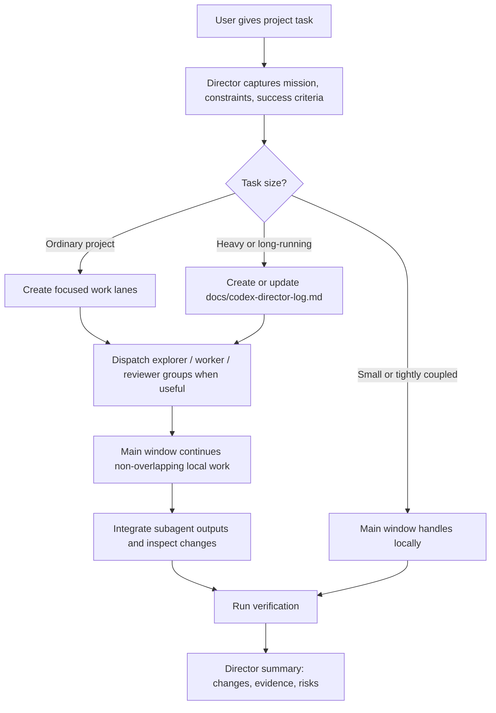

# Project Director


**Turn long Codex project chats into director-led execution with focused subagent teams, persistent requirements, and final integration control.**

When a project gets large, the main conversation can become the weakest link: requirements get buried, context gets compressed, subagents drift, and the final answer becomes a pile of partial summaries. Project Director gives Codex a stricter operating model: the main window acts as the project director, subagents become bounded work groups, and the project state is preserved in a lightweight control log when the work is long or risky.

Use it when you want Codex to coordinate real project work instead of just "trying harder" inside one overloaded context window.

```text
Use $project-director to coordinate this project.
You are the director. Split work into subagent groups when useful,
preserve requirements, and verify the final result.
```

## Why This Exists

Large Codex tasks often fail for coordination reasons, not intelligence reasons.

- A long conversation gets compressed and earlier constraints fade.
- Multiple files or modules need parallel investigation.
- Subagents are useful, but only if they have clear ownership.
- Worker agents can accidentally overlap, over-edit, or return disconnected results.
- The main window needs to synthesize and verify, not just paste summaries.

Project Director makes those responsibilities explicit.

## Before And After

| Without Project Director | With Project Director |
| --- | --- |
| One overloaded chat tries to remember everything. | The main window owns a compact mission, constraints, and decisions. |
| Subagents may receive vague tasks. | Each group gets a role, scope, forbidden areas, and expected output. |
| Workers can overlap or edit too broadly. | Workers operate inside assigned ownership boundaries. |
| Context compaction can erase earlier requirements. | Long tasks get `docs/codex-director-log.md` as durable project memory. |
| Final answers become stitched-together summaries. | The director integrates, verifies, and reports one coherent result. |

## What It Does

Project Director gives Codex a repeatable operating system for complex work:

| Capability | What changes in practice |
| --- | --- |
| Director window | The main chat owns the mission, constraints, decisions, integration, and final delivery. |
| Work lanes | The task is split by module, file set, risk area, research question, or verification lane. |
| Agent roles | Explorers investigate, workers implement inside assigned scope, reviewers inspect risk and quality. |
| Persistent memory | Long-running tasks use `docs/codex-director-log.md` to survive context compaction. |
| Integration gate | The director reviews subagent output, checks scope, runs verification, and reports one coherent result. |

## Workflow



## When To Use It

Use `$project-director` for:

- multi-file coding tasks
- frontend/backend/test work that can run in parallel
- debugging with several possible root causes
- refactors that need ownership boundaries
- research plus implementation tasks
- long-running tasks likely to hit context compaction
- document, spreadsheet, or presentation projects with separate content and QA lanes
- any task where you want Codex to act like a technical lead instead of a single-threaded assistant

Do not use it for tiny, single-answer tasks. The skill deliberately keeps small or tightly coupled work local.

## Quick Start

Install from GitHub:

```powershell
git clone https://github.com/iannoahleads-cyber/project-director-skill.git "$env:USERPROFILE\.codex\skills\project-director"
```

Restart Codex, then invoke:

```text
Use $project-director to coordinate this project. Act as the director and open subagent groups when useful.
```

Chinese examples:

```text
用 $project-director 做这个项目，你当总监开几组 subagent 分工推进。
这个任务可能很长，帮我总控、分组、记录要求，最后统一验收。
前端、后端、测试都要动，你来拆组推进，别让上下文压缩后忘记要求。
```

## Example Scenario

Ask Codex:

```text
Use $project-director for this repository.
We need to change the dashboard, update the API contract, add tests,
and avoid losing the constraints if the conversation gets compressed.
Split the work into groups, keep a director log if needed, and verify before final delivery.
```

Project Director pushes Codex toward this shape:

```text
Director:
- Mission and constraints captured.
- This is a heavy project because frontend, backend, and tests are involved.
- Creating docs/codex-director-log.md.

Explorer group:
- Map current architecture and test commands.

Frontend worker:
- Own dashboard UI files only.

Backend worker:
- Own API contract and server logic only.

Reviewer:
- Check integration, tests, and scope drift.
```

## How The Workflow Feels

Instead of immediately editing files, Codex first establishes a control surface:

```text
Mission:
Build X without breaking Y.

Constraints:
- Keep existing design patterns.
- Do not touch unrelated files.
- Verify with build and tests.

Work lanes:
- Explorer: map current architecture and risk.
- Worker A: frontend scope only.
- Worker B: backend scope only.
- Reviewer: integration and verification.
```

For heavier work, the director creates or updates:

```text
docs/codex-director-log.md
```

That file records the mission, constraints, work lanes, decisions, current state, blockers, and verification results. If context is compressed later, Codex has a durable project memory to reload before continuing.

## Agent Roles

### Explorer

Explorers are read-only. They map the codebase, compare approaches, identify risks, and return evidence with file paths. They do not edit files.

### Worker

Workers can edit, but only inside explicit ownership boundaries. A worker prompt includes scope, forbidden areas, acceptance criteria, and expected verification.

### Reviewer

Reviewers check spec compliance, code quality, integration risk, and verification gaps. They report findings first, not compliments.

## What Makes It Different

This is not just "use more subagents."

Project Director treats subagents as teams inside a managed delivery process. The main window remains accountable for:

- preserving the user's actual requirements
- deciding when parallelism is appropriate
- preventing overlapping edits
- rejecting out-of-scope work
- integrating results into one coherent change
- verifying the final project state

The goal is faster project work without losing the thread.

## Repository Layout

```text
project-director/
├── SKILL.md
├── README.md
├── LICENSE
└── agents/
    └── openai.yaml
```

## Local Development

Validate the skill:

```powershell
$env:PYTHONUTF8='1'
python "$env:USERPROFILE\.codex\skills\.system\skill-creator\scripts\quick_validate.py" .
```

Security scan:

```powershell
python "$env:USERPROFILE\.codex\skills\agent-skill-creator\scripts\security_scan.py" .
```

## License

MIT License.
