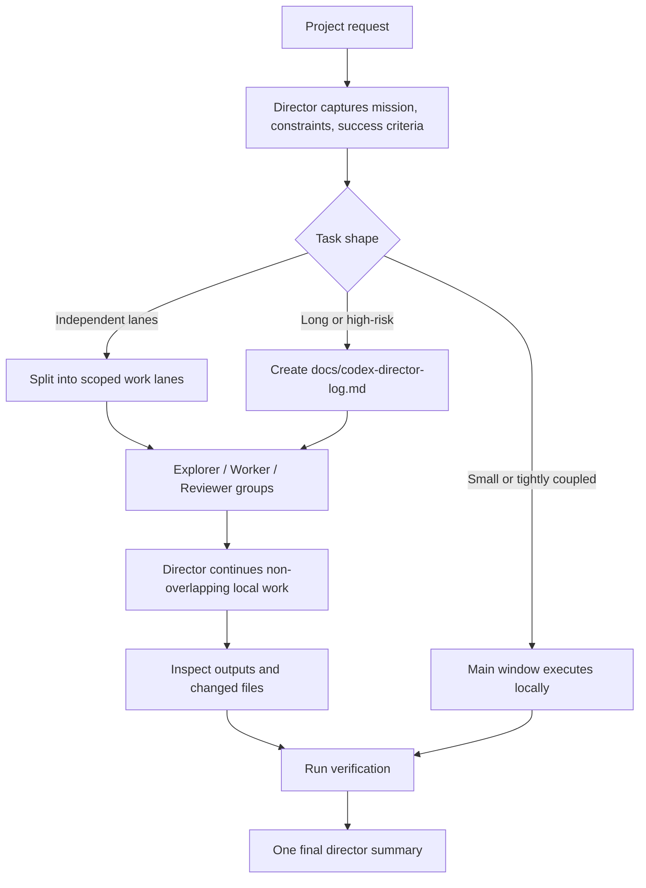

# Project Director


**A coordination skill for Codex projects that are too large, too long, or too parallel for one fragile chat context.**

Project Director turns Codex into a project control plane. The main window keeps ownership of requirements, decisions, integration, and verification, while subagents become bounded explorer, worker, and reviewer groups. For long-running work, the skill creates a durable project memory with `docs/codex-director-log.md` so context compaction does not erase the mission.

Use it when the hard part is not just writing code, but keeping a multi-step AI-assisted project coherent.

```text
Use $project-director to coordinate this project.
You are the director. Split work into subagent groups when useful,
preserve requirements, prevent scope drift, and verify the final result.
```

## The Problem

Large Codex tasks usually fail at the coordination layer.

| Failure mode | What it looks like |
| --- | --- |
| Context decay | Earlier constraints disappear after a long conversation or context compaction. |
| Vague delegation | Subagents receive broad prompts and return partial, disconnected summaries. |
| Write-scope overlap | Multiple workers touch the same files or undo each other's assumptions. |
| Lost integration | Each piece looks fine alone, but the combined project does not hold together. |
| Weak verification | The final answer describes effort instead of proving the result. |

Project Director makes those failure modes explicit and gives Codex a workflow to avoid them.

## Core Model



The main window is never just a dispatcher. It is responsible for the project state.

## Operational Contract

| Role | Contract |
| --- | --- |
| Director | Own the mission, constraints, decisions, work lanes, integration, and final delivery. |
| Explorer | Read-only investigation: architecture, risks, file paths, options, root causes. |
| Worker | Bounded implementation inside assigned files, modules, or responsibility. |
| Reviewer | Independent pass for spec compliance, code quality, verification gaps, and scope drift. |
| Control log | Persistent state for long tasks: mission, constraints, lanes, decisions, status, verification. |
| Verification gate | Completion requires evidence: tests, builds, render checks, manual inspection, or equivalent proof. |

## What Makes It Different

This is not a prompt that says "use more subagents."

It defines a delivery model:

- classify the task before spawning agents
- keep small or tightly coupled work local
- delegate only independent lanes
- give every worker ownership and forbidden areas
- keep explorers read-only
- use reviewers for risk, not decoration
- preserve long-running state in a control log
- synthesize results in the main window
- verify before reporting completion

The result is faster parallel work without losing the thread.

## When To Use It

Use `$project-director` for:

- multi-file feature work
- frontend/backend/test changes that can run in parallel
- debugging with several plausible root causes
- refactors that need ownership boundaries
- research plus implementation tasks
- long-running projects likely to hit context compaction
- document, spreadsheet, or presentation work with separate content and QA lanes
- any task where you want Codex to behave like a technical lead, not a single-threaded assistant

Do not use it for tiny, single-answer tasks. The skill deliberately keeps small or tightly coupled work local.

## Install

Install into your Codex skills directory:

```powershell
git clone https://github.com/iannoahleads-cyber/project-director-skill.git "$env:USERPROFILE\.codex\skills\project-director"
```

Restart Codex after installation.

## Prompt Examples

```text
Use $project-director for this repository.
We need to change the dashboard, update the API contract, add tests,
and avoid losing constraints if the conversation gets compressed.
Split the work into groups, keep a director log if needed, and verify before final delivery.
```

```text
用 $project-director 做这个项目，你当总监开几组 subagent 分工推进。
这个任务可能很长，帮我总控、分组、记录要求，最后统一验收。
前端、后端、测试都要动，你来拆组推进，别让上下文压缩后忘记要求。
```

## Director Log Schema

For long or risky work, Project Director tells Codex to create or update:

```text
docs/codex-director-log.md
```

Suggested structure:

```markdown
# Codex Director Log

## Mission
- Goal:
- User constraints:
- Success criteria:

## Work Lanes
- Lane:
  - Owner:
  - Scope:
  - Forbidden:
  - Expected output:

## Decisions
- YYYY-MM-DD:

## Current State
- Done:
- In progress:
- Blocked:
- Verification:
```

After context compaction, the director should reload this file, inspect the current git diff, check the latest verification state, and only then continue.

## Subagent Prompt Contract

Every delegated worker should receive:

- the overall mission
- exact ownership boundaries
- files or modules it may edit
- files, modules, or behaviors it must not touch
- acceptance criteria
- verification command or expected proof
- required return format: changed files, implementation summary, verification result, risks

Every explorer should receive a read-only scope and return evidence with file paths.

Every reviewer should report findings first, with concrete risks and fixes.

## Example Work Split

```text
Director:
- Capture mission and constraints.
- Classify as heavy project.
- Create docs/codex-director-log.md.

Explorer:
- Map architecture, package scripts, test commands, and risky integration points.

Frontend worker:
- Own dashboard UI and client state only.

Backend worker:
- Own API contract and server logic only.

Test worker:
- Own unit/integration/E2E coverage, avoiding implementation-file overlap.

Reviewer:
- Check spec compliance, integration risk, and verification completeness.
```

## Repository Layout

```text
project-director/
├── SKILL.md
├── README.md
├── LICENSE
└── agents/
    └── openai.yaml
```

## Validate Locally

```powershell
$env:PYTHONUTF8='1'
python "$env:USERPROFILE\.codex\skills\.system\skill-creator\scripts\quick_validate.py" .
```

```powershell
python "$env:USERPROFILE\.codex\skills\agent-skill-creator\scripts\security_scan.py" .
```

## License

MIT License.
