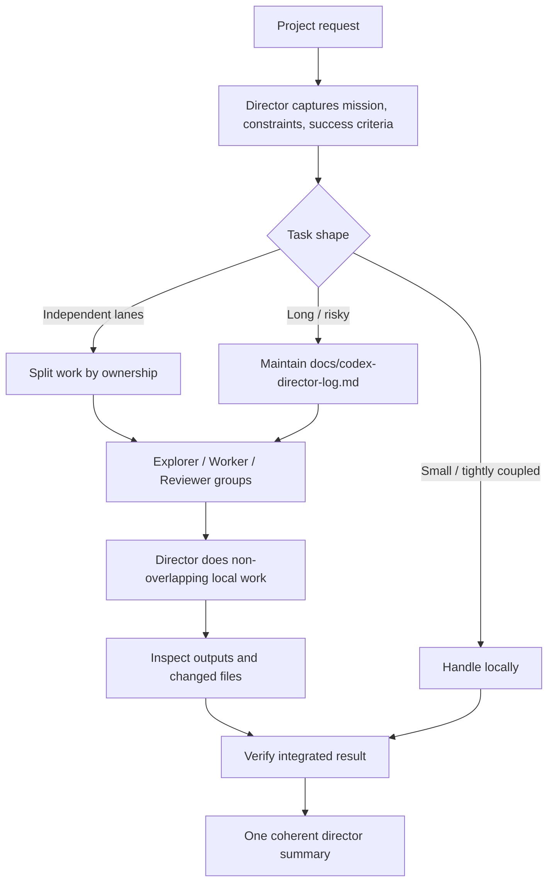

# Project Director


**Stop losing requirements in long Codex projects.**

Project Director is a Codex skill for project work that needs more than one overloaded chat context. It turns the main Codex window into a director: it preserves the mission, splits independent work into subagent lanes, keeps workers inside ownership boundaries, records durable project state when needed, and verifies the integrated result before reporting back.

Use it when Codex is not failing because it cannot code, but because the project is long, parallel, stateful, or easy to forget halfway through.

```text
Use $project-director for this repository.
Act as the director: preserve requirements, split independent work,
use subagent groups only where useful, and verify the final result.
```

## Why Developers Care

Codex can already inspect, edit, test, and delegate. The hard part is keeping those capabilities coordinated when a task spans many files, many turns, or several agents.

Project Director is built for the failure modes that show up in real agentic development:

| Failure mode | Symptom | Project Director response |
| --- | --- | --- |
| Context decay | Earlier constraints disappear after a long run or compaction. | Create a compact `docs/codex-director-log.md` when the task is long or risky. |
| Vague delegation | Subagents return disconnected summaries. | Assign each group a role, scope, forbidden areas, and expected output. |
| Edit overlap | Multiple workers touch the same files or undo assumptions. | Use disjoint ownership boundaries before spawning workers. |
| Lost integration | Each slice seems fine, but the combined project fails. | Main window integrates, inspects changed files, and resolves conflicts. |
| Weak verification | Final answer says what was attempted, not what was proven. | Require tests, builds, render checks, manual checks, or equivalent evidence. |

## 30-Second Model



The main window is not a messenger. It owns the project state.

## What It Adds To Codex

| Layer | Contract |
| --- | --- |
| Director | Own the mission, constraints, decisions, work lanes, integration, and final delivery. |
| Explorer | Read-only investigation: architecture, risks, file paths, options, root causes. |
| Worker | Bounded implementation inside assigned files, modules, or responsibility. |
| Reviewer | Independent pass for spec compliance, code quality, verification gaps, and scope drift. |
| Control log | Persistent state for long tasks: mission, constraints, lanes, decisions, status, verification. |
| Verification gate | Completion requires evidence: tests, builds, screenshots, renders, manual checks, or equivalent proof. |

## Quick Install

Windows:

```powershell
git clone https://github.com/iannoahleads-cyber/project-director-skill.git "$env:USERPROFILE\.codex\skills\project-director"
```

macOS / Linux:

```bash
git clone https://github.com/iannoahleads-cyber/project-director-skill.git ~/.codex/skills/project-director
```

Restart Codex after installation.

## Copy-Paste Prompts

For a codebase:

```text
Use $project-director for this repository.
We need to change the dashboard, update the API contract, add tests,
and avoid losing constraints if the conversation gets compressed.
Split the work into groups, keep a director log if needed, and verify before final delivery.
```

For a long task:

```text
Use $project-director. This task may take many turns.
Track the mission, constraints, decisions, work lanes, blockers, and verification state.
If context compaction becomes likely, maintain docs/codex-director-log.md.
```

Another prompt:

```text
用 $project-director 做这个项目，你当总监开几组 subagent 分工推进。
这个任务可能很长，帮我总控、分组、记录要求，最后统一验收。
前端、后端、测试都要动，你来拆组推进，别让上下文压缩后忘记要求。
```

## Example: How A Split Looks

User request:

```text
Refactor the billing dashboard. The frontend, backend contract, and tests all need updates.
Do not lose the existing UX constraints if the chat gets long.
```

Expected director behavior:

```text
Director:
- Capture mission, constraints, acceptance criteria.
- Classify as heavy project.
- Create docs/codex-director-log.md.
- Keep integration and verification ownership in the main window.

Explorer:
- Map frontend entry points, API routes, test commands, and risky integration seams.

Frontend worker:
- Own dashboard UI and client state only.
- Must not edit server routes or test infrastructure.

Backend worker:
- Own API contract and server logic only.
- Must not edit frontend presentation files.

Test worker:
- Own unit/integration/E2E coverage.
- Avoid implementation-file overlap unless explicitly assigned.

Reviewer:
- Check requirement coverage, scope drift, integration risk, and verification evidence.
```

## Director Log Schema

For long or risky work, the skill instructs Codex to create or update:

```text
docs/codex-director-log.md
```

Minimal schema:

```markdown
# Codex Director Log

## Mission
- Goal:
- User constraints:
- Success criteria:

## Work Lanes
- Lane:
  - Owner:
  - Scope:
  - Forbidden:
  - Expected output:

## Decisions
- YYYY-MM-DD:

## Current State
- Done:
- In progress:
- Blocked:
- Verification:
```

After context compaction, the director reloads the log, checks the current git diff, checks the latest verification state, and only then continues.

## Subagent Prompt Contract

Every worker should receive:

- overall mission
- exact ownership boundaries
- files or modules it may edit
- files, modules, or behaviors it must not touch
- acceptance criteria
- verification command or expected proof
- return format: changed files, implementation summary, verification result, risks

Every explorer should be explicitly read-only and return evidence with file paths.

Every reviewer should report findings first, with concrete risks and fixes.

## When Not To Use It

Do not use Project Director for:

- tiny single-answer questions
- one-file edits with no coordination risk
- tasks where all work must happen in one tightly coupled sequence
- situations where subagents are unavailable and a local checklist is enough

The skill is intentionally conservative: it should add structure when structure pays for itself.

## Repository Layout

```text
project-director/
├── SKILL.md
├── README.md
├── LICENSE
└── agents/
    └── openai.yaml
```

## Validate Locally

```powershell
$env:PYTHONUTF8='1'
python "$env:USERPROFILE\.codex\skills\.system\skill-creator\scripts\quick_validate.py" .
```

```powershell
python "$env:USERPROFILE\.codex\skills\agent-skill-creator\scripts\security_scan.py" .
```

## License

MIT License.
